# Hortator Architecture

## System Overview

## Key Components

| Component | Description |
|-----------|-------------|
| **Operator** | Core reconciler — watches AgentTask CRDs, creates Pods, brokers results, enforces policies |
| **API Gateway** | OpenAI-compatible HTTP API (`/v1/chat/completions`, `/v1/models`). Translates chat requests into AgentTask CRDs. Optional, opt-in via `gateway.enabled`. |
| **Warm Pod Pool** | Pre-provisioned idle Pods that accept tasks immediately (<1s vs 5-30s cold start). Optional, opt-in via `warmPool.enabled`. See [warm-pool.md](warm-pool.md). |
| **Result Cache** | Content-addressable cache keyed on SHA-256(prompt+role). Identical tasks return instantly without spawning Pods. In-memory LRU with TTL. Optional, opt-in via `resultCache.enabled`. |
| **Presidio Service** | Centralized PII detection Deployment+Service (not a sidecar). Agent pods call via cluster DNS. Enterprise feature. |
| **Agentic Runtime** | Python tool-calling loop for tribune/centurion tiers. Uses `litellm` for provider-agnostic LLM calls, supports checkpoint/restore for the reincarnation model. Located at `runtime/agentic/`. |

## Task Lifecycle

## Override Precedence

```mermaid
graph LR
    A["⎈ Helm values.yaml<br/>(cluster defaults)"] --> B["📋 AgentRole CRD<br/>(role overrides)"]
    B --> C["📋 AgentTask CRD<br/>(task overrides)"]
    C --> D["✅ Effective Config"]
    
    style A fill:#e8e8e8,color:#333
    style B fill:#c8d8e8,color:#333
    style C fill:#a8c8d8,color:#333
    style D fill:#4a90d9,color:#fff
```

Applies to: model selection, health thresholds, Presidio config, budget limits, capabilities.

## Storage Lifecycle

## Operator Components

The operator is split into focused files under `internal/controller/`:

| File | Purpose |
|------|---------|
| `agenttask_controller.go` | Main reconciliation loop, phase machine, struct definitions |
| `pod_builder.go` | Pod spec construction, PVC creation, volume mounts, knowledge discovery integration |
| `helpers.go` | Config loading, PVC reader, token extraction, parent notification, child result injection |
| `metrics.go` | Prometheus metrics (tasks, duration, cost, stuck detection) and OTel event emission |
| `budget.go` | LiteLLM price map loader, cost calculation, budget enforcement |
| `health.go` | Stuck detection signal analysis (tool diversity, prompt repetition, staleness), action execution |
| `knowledge.go` | Retained PVC discovery, tag matching, context.json generation |
| `policy.go` | AgentPolicy enforcement |
| `warm_pool.go` | Warm Pod pool management |
| `result_cache.go` | Content-addressable result cache |
